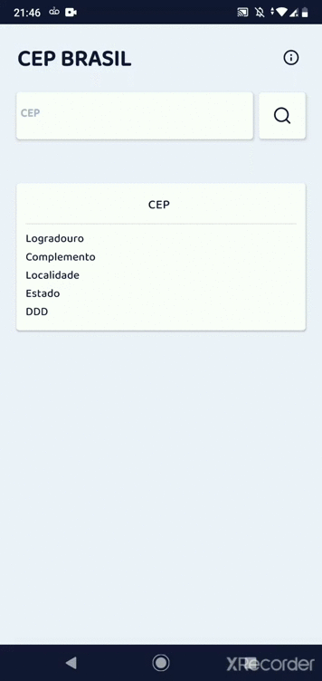

<h1 align="center">
    
   
</h1>

<h2 align="center">
Consumindo API para resgatar dados do CEP digitado
</h2>

 
  

> Status do Projeto: Em desenvolvimento :hammer:

 
  

  
 

## :rocket: Tecnologias

Esse projeto foi desenvolvido utilizandoendo as seguintes tecnologias:

-  [Flutter](https://flutter.dev/)
-  [Dart](https://dart.dev/)
-  [API](https://viacep.com.br/)
-  [Unicons](https://pub.dev/packages/unicons/changelog)
-  [VS code](https://code.visualstudio.com/)

-  [Android Studio](https://developer.android.com/studio)

Feito com ♥ por Ricardo Monteiro  [Entrar em contato!](https://www.linkedin.com/in/ricardohmonteiro/)

